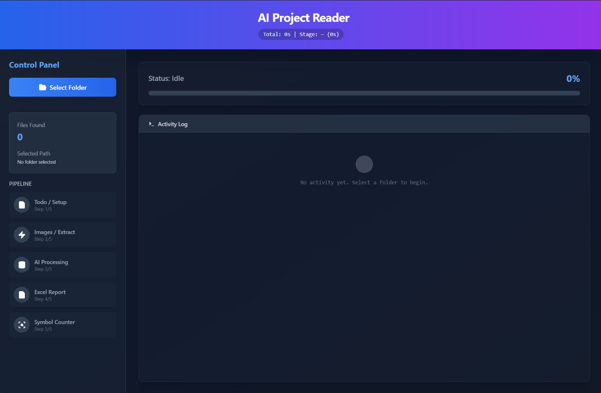
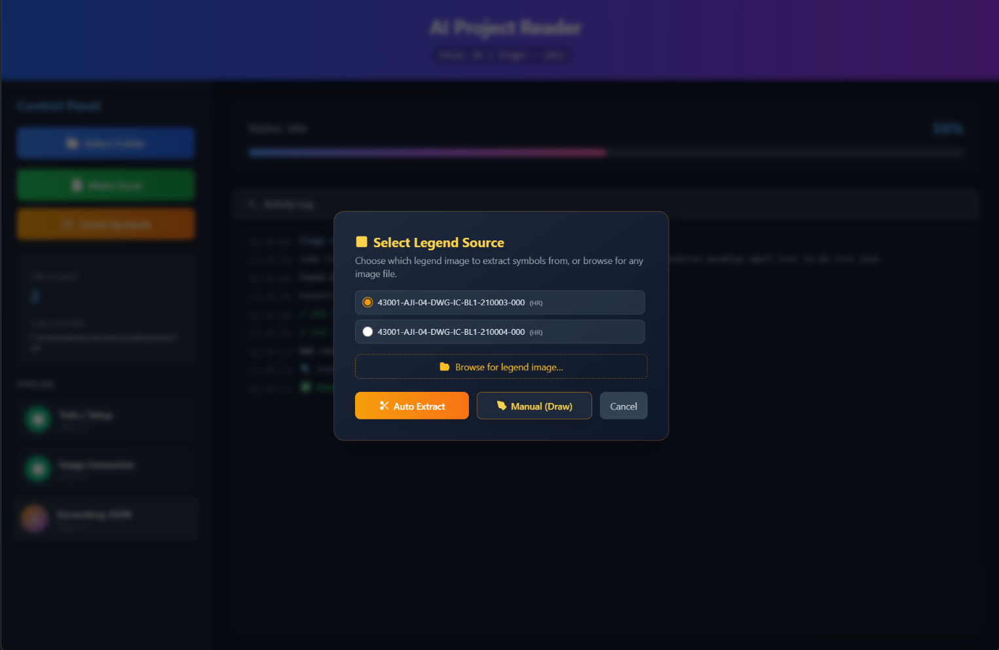
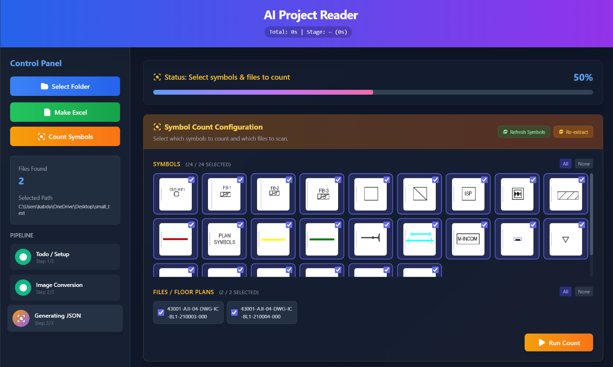
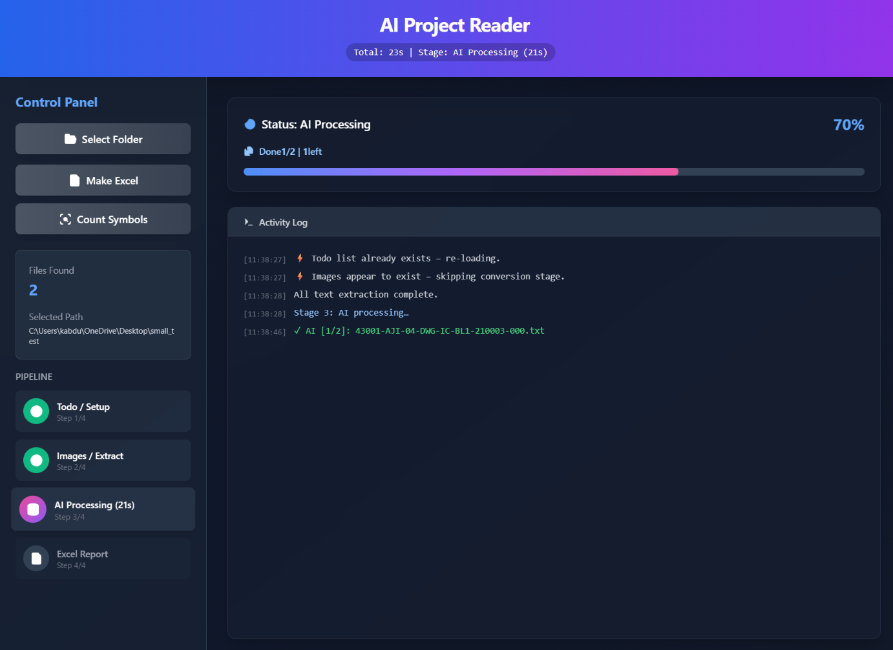
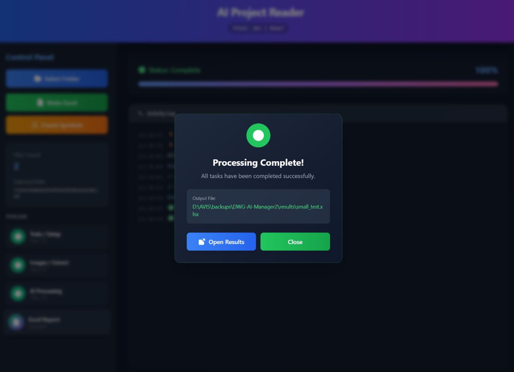
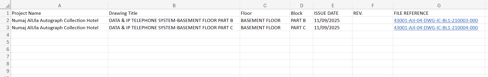
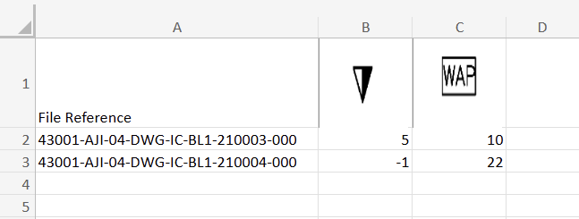

# DWG-AI-Manager

> **Status:** 🚧 Under development (v-0.0.8.0) 🚧

DWG-AI-Manager is a lightweight tool focused on analyzing AutoCAD DWG drawings. It automatically processes drawing files to extract key information and detect symbols, then generates structured Excel reports.

The system is designed to simplify working with large sets of engineering drawings by turning visual data into organized, usable outputs.

---

## Features

- **Document Processing (AI Project Reader Mode)**
  - Collects documentation files (DWG, PDF, DOCX, XLSX) from a selected project source folder.
  - Generates PDFs from `.dwg` files using AutoCAD's Core Console automatically.
  - Extracts text and visual contexts natively from standard documents.
  - Utilizes YOLO models to identify and crop critical text and tables from drawings (Information Boxes, Legends).
  - Employs OCR (Tesseract) on cropped images to deduce context.
  - Connects to a Local AI Model to deduce and draft project summaries based on processed text.
  - Outputs a complete summary report in Excel format.

- **Floor Plan Symbol Detection (Legend Counter Mode)**
  - Seamlessly bridges AutoCAD floor plan drawings into computable artifacts.
  - Provides a dynamic interface spanning multi-angle detection and Template Matching based matching.
  - Extracts available legends and symbols implicitly or manually from source images.
  - Autonomously traverses documents checking against provided symbols and intelligently handles noise via complex contouring algorithms.
  - Outputs count results into an Excel report.

- **Desktop UI Interface**
  - Features a PyWebView-driven frontend that bundles Flask internally as a subprocess for robust multi-processed execution.

---

## Screenshots

### Main Interface


### Legend Extractor


### Legend Counter


### DWG List




### Excel Output — DWG List

 
### Excel Output — Symbol Count Report


---

## Excel Output

The program generates two separate Excel reports depending on the mode used:

- **DWG List Report** — A structured list of all processed DWG files found in the project folder, generated by the AI Project Reader mode.
- **Symbol Count Report** — A per-floor-plan count of each detected symbol, generated by the Legend Counter mode.

Each report is saved independently in the `results/` folder based on which mode you run.

---

## System Prerequisites

1. **AutoCAD**
   AutoCAD must be installed on your host machine to enable DWG to PDF conversion. By default, `accoreconsole.exe` is expected at:
   ```
   C:\Program Files\Autodesk\AutoCAD 2026\
   ```
   Adjust `DWG_Process/DWG_TO_PDF.py` accordingly based on your AutoCAD version.

2. **Tesseract OCR Engine**
   The Tesseract binary must be placed inside the project directory. See [External Dependencies](#external-dependencies) below.

3. **Ghostscript**
   Required for PDF rendering in the OCR pipeline. Must be placed inside the project directory. See [External Dependencies](#external-dependencies) below.

4. **Local LLM API**
   A local LLM server running a fast vision-language model is required. Set up `.env` or adapt `Text_Process/API_client.py` to point to your inference endpoint.

5. **Python + System Drivers**
   - Python 3.10+ recommended.
   - NVIDIA GPUs with CUDA configured for YOLO parsing capabilities (CPU fallback exists but is slower).

---

## External Dependencies

The following tools must be downloaded and placed manually inside the project directory. They are not included in the repository due to their size.

### 1. Tesseract OCR

Download the Windows installer from:
👉 [tesseract](https://github.com/tesseract-ocr/tesseract)

After installing, copy the Tesseract installation folder into the **project root** and rename it to `Tesseract/`:

```
DWG-AI-Manager/
└── Tesseract/
    ├── tesseract.exe        ← required
    ├── tessdata/
    │   └── eng.traineddata  ← make sure English data is included
    └── ...
```

> The app expects `Tesseract/tesseract.exe` relative to the project root.

---

### 2. Ghostscript

Download the Windows 64-bit installer from:
👉 [Ghostscript Official Downloads](https://www.ghostscript.com/releases/gsdnld.html)

After installing, copy the Ghostscript folder into the `OCR/` directory and name it to match the expected path:

```
DWG-AI-Manager/
└── OCR/
    └── gs10.06.0/
        └── bin/
            └── gsdll64.dll  ← required
```

> If you install a different version, update the path reference in `OCR/` accordingly.

---

## Setup & Installation

1. **Clone the repository**
   ```bash
   git clone https://github.com/Astro-5444/DWG-AI-Manager.git
   cd DWG-AI-Manager
   ```

2. **Place external dependencies**
   Follow the [External Dependencies](#external-dependencies) section above to set up Tesseract and Ghostscript.

3. **Install Python requirements**
   ```bash
   pip install -r requirements.txt
   ```
   > **Note:** We recommend installing PyTorch tailored for your specific CUDA environment. See [PyTorch's Official Guide](https://pytorch.org/).

4. **Configure environment**
   Copy `.env.example` to `.env` and fill in your local LLM endpoint:
   ```bash
   copy .env.example .env
   ```

---

## How to Run & Use

### 🚀 Running the Program

1. **Launch the Desktop UI**
   ```bash
   python webview_app.py
   ```
   This initializes a multi-processed environment where:
   - A **Flask backend** handles the heavy logic (DWG processing, OCR, AI integration).
   - A **PyWebView frontend** provides a clean, desktop-like experience.

2. **Using Server Mode (Optional)**
   If you prefer to run the backend as a standalone service accessible via browser at `http://localhost:5009`:
   ```bash
   python app.py
   ```

---

### 📖 How to Use

#### Mode 1: AI Project Reader (Document Analysis)

1. **Select Source Folder** — Choose the directory containing your project documents (DWGs, PDFs, Word, Excel).
2. **Scanning** — The program identifies all supported files and builds a processing queue.
3. **Extraction**
   - DWG files are automatically converted to PDFs and parsed for Information Boxes and Legends via YOLO and OCR.
   - Standard documents (PDF, DOCX, XLSX) have their text extracted directly.
4. **AI Summary** — Extracted data is sent to your local AI model to generate structured findings.
5. **Output** — A DWG list report is saved as an Excel file in the `results/` folder.

#### Mode 2: Legend Counter (Symbol Counting)

1. **Extract Symbols** — Identify symbols from a Legend image or the Information Box of a floor plan.
2. **Detection** — Select the floor plans to process. The program uses multi-angle Hu-moment matching and advanced contour analysis to locate every instance of each symbol.
3. **Report** — A symbol count report per floor plan is exported as an Excel file in the `results/` folder.

---

## Modifying for Your Platform

- Re-verify Python `PATH` locations for AutoCAD if DWG conversion fails.
- Adjust memory or thresholds in `OCR/yolo_inference.py` based on your machine's limitations.

---

## Notes

1. This tool is primarily focused on DWG drawings. Support for PDF, Word, and Excel document analysis is planned for a future release.
2. The system runs entirely locally — no external AI APIs are used. Make sure your machine can handle the processing load.
3. The symbol counter is still experimental and may not be fully reliable. An alternative approach is available under `Legend_Counter/Counter(experimental)/` — feel free to modify or enhance whichever method works best for your case.

---

## Code Attribution and License

Copyright (c) 2026 ASTRO-5444. This project is licensed under the MIT License. See `LICENSE` for full details.
